<p align="center">
  
</p>

<p align="center">
  <a href="https://memosr.com"></a>
  <a href="https://x.com/memosrETH"></a>
  <a href="https://hey.xyz/u/memosr"></a>
  <a href="https://t.me/memosrr"></a>
</p>

<br/>

```solidity
// SPDX-License-Identifier: MIT
pragma solidity ^0.8.24;

contract Memosr {
    string public constant role     = "Blockchain Developer & Node Operator";
    string public constant base     = "Istanbul, TR";
    uint256 public constant chainId = 8453; // Base

    string[] public focus = [
        "Smart contracts with Solidity + Foundry",
        "On-chain data primitives",
        "Agent tooling: MCP servers, x402 payments",
        "Full-stack Web3: contract -> frontend -> deploy"
    ];
}
```

<br/>

## ◆ Shipped on Base

<table>
  <tr>
    <td width="50%" valign="top">
      <h3>⛽ Base Gas Tracker</h3>
      <p>Real-time gas monitor for Base mainnet with fee calculator and 24h chart.</p>
      <a href="https://base-gas-tracker-lyart.vercel.app"></a>
      <a href="https://github.com/memosr/base-gas-tracker"></a>
    </td>
    <td width="50%" valign="top">
      <h3>🔌 Base Gas MCP</h3>
      <p>MCP server for live Base gas data, paid per call via x402.</p>
      <a href="https://www.npmjs.com/package/base-gas-mcp"></a>
      <a href="https://github.com/memosr/base-gas-mcp"></a>
    </td>
  </tr>
  <tr>
    <td width="50%" valign="top">
      <h3>📜 Letters to the Future</h3>
      <p>On-chain time capsule letters, mintable as NFTs.</p>
      <a href="https://letters-to-the-future.vercel.app"></a>
      <a href="https://github.com/memosr/letters-to-the-future"></a>
    </td>
    <td width="50%" valign="top">
      <h3>📊 CodeTrack</h3>
      <p>Analytics dashboard for ERC-8021 Builder Codes.</p>
      <a href="https://codetrack-phi.vercel.app"></a>
      <a href="https://github.com/memosr/codetrack"></a>
    </td>
  </tr>
</table>

<br/>

## ◆ Toolchain

<p>
  
</p>

<p>
  
  
  
  
  
  
</p>

<br/>

## ◆ On-chain Activity

<p align="center">
  
</p>

<p align="center">
  
  
</p>

<br/>

<p align="center">
  
</p>
